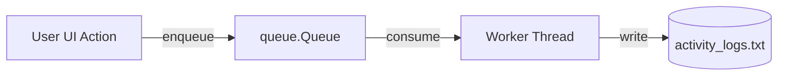

# Presentation Deck: Secure User Management System

**Course Project**: Object-Oriented Programming (OOP) in Python  
**Target Institute**: Cyber Security Institute  
**Authors**: Software Engineering & Security Team  
**Slides Count**: 10 Slides  

---

## Slide 1: Title Slide & Project Overview

### Secure User Management System
*A Modular, Object-Oriented Python Application for Cyber Security Institutions*

- **Core Technologies**: Python 3.10+, Standard Cryptography, Threading, JSON/CSV I/O
- **Key Paradigms**: Encapsulation, Inheritance, Polymorphism, Custom Exception Handling, Modular Architecture
- **Key Features**: Salted Password Hashing, Account Lockout Policy, Asynchronous Multithreaded Logging, Data Export

> **Speaker Notes**:  
> Welcome everyone. Today we are presenting the Secure User Management System designed specifically for a Cyber Security Institute. This project demonstrates industrial OOP principles in Python alongside robust security mechanisms such as PBKDF2 password hashing, custom exception handling, multithreaded activity logging, and JSON persistence.

---

## Slide 2: Problem Statement & Objectives

### Background & Problem Statement
Cyber Security institutes manage multiple user personas with varying security privileges (e.g. Administrators and Security Analysts). Handling sensitive credentials requires strict data protection and activity logging.

### System Objectives
1. **Encapsulate Credentials**: Restrict raw access to sensitive data (passwords, salts).
2. **Support Role Hierarchy**: Utilize inheritance for `Administrator` and `SecurityAnalyst` roles.
3. **Enforce Input Validation**: Provide custom exception handling for emails, user IDs, and password strength.
4. **Organize Modular Code**: Structure system cleanly using Python packages (`users`, `exceptions`, `utilities`, `storage`).
5. **Audit & Log Activities**: Maintain non-blocking background activity logs.

> **Speaker Notes**:  
> Raw data exposure is a major vulnerability. Our system solves this by combining OOP encapsulation with PBKDF2 cryptographic hashing and an asynchronous activity logger.

---

## Slide 3: System Architecture & Package Structure

```
secure_system/
│
├── exceptions/          # Custom Exception Hierarchy
│   └── custom_exceptions.py (UserManagementException, InvalidEmailException, ...)
│
├── utilities/           # Helper Modules
│   ├── validator.py     # Regex & input validation
│   ├── security.py      # Salted PBKDF2 SHA-256 Hashing
│   └── logger.py        # Asynchronous Multithreaded Logger
│
├── users/               # Core OOP Domain Model
│   ├── user.py          # Abstract Base Class User
│   ├── administrator.py # Derived Administrator Class
│   └── analyst.py        # Derived SecurityAnalyst Class
│
└── storage/             # Data Persistence Layer
    └── persistence.py   # JSON save/load, CSV export, Audit reports
```

> **Speaker Notes**:  
> Here is our modular package structure. Each package has a single, well-defined responsibility. This decouples business logic from validation, security, logging, and data persistence.

---

## Slide 4: Part A - Class Design & Encapsulation

### Base Class `User` & Encapsulation Features
- **Private Attributes**: Attributes prefixed with double underscores (`__user_id`, `__email`, `__password_hash`, `__salt`) prevent external direct modification.
- **Property Decorators**: Controlled access via `@property` getters and validated setters.
- **Cryptographic Hashing**: Plaintext passwords are salted with 16-byte random salts and hashed via PBKDF2 SHA-256 (100,000 iterations).

```python
@property
def name(self) -> str:
    return self.__name

@name.setter
def name(self, new_name: str):
    self.__name = Validator.validate_name(new_name)
```

- **Special Methods Overridden**: `__str__()`, `__repr__()`, `__eq__()`.

> **Speaker Notes**:  
> Encapsulation guarantees that sensitive fields like password hashes cannot be modified arbitrarily. Any property update must pass through validator filters.

---

## Slide 5: Part B - Inheritance & Runtime Polymorphism

### Class Hierarchy
- **Base Class**: `User` (Abstract base defining interface).
- **Derived Class**: `Administrator` (Extends `User` using `super().__init__()`).
- **Derived Class**: `SecurityAnalyst` (Extends `User` using `super().__init__()`).

### Runtime Polymorphism in Action
Methods `get_privileges()`, `execute_role_task()`, and `generate_dashboard_summary()` are polymorphically overridden in child classes.

```python
# Polymorphic Call Loop
for user in user_list:
    print(user.get_privileges())      # Role-specific privileges
    print(user.execute_role_task())  # Role-specific execution
```

> **Speaker Notes**:  
> Polymorphism allows our controller loop to iterate over heterogeneous lists of `User` references and invoke role-appropriate behavior dynamically at runtime.

---

## Slide 6: Part C - Custom Exception Handling

### Exception Taxonomy
All custom exceptions inherit from `UserManagementException`:
- `InvalidEmailException`: Invalid RFC format.
- `WeakPasswordException`: Fails length, digit, or symbol rules.
- `InvalidUserIDException`: Fails `AAA-123` formatting rule.
- `AuthenticationFailedException` & `AccountLockedException`.

### Defensive Try-Except-Else-Finally Structure
```python
try:
    user.authenticate(password)
except AccountLockedException as ex:
    logger.log(user.user_id, "LOGIN", "LOCKED", str(ex))
except AuthenticationFailedException as ex:
    logger.log(user.user_id, "LOGIN", "FAILURE", str(ex))
else:
    logger.log(user.user_id, "LOGIN", "SUCCESS", "Logged in.")
finally:
    save_system_state()
```

> **Speaker Notes**:  
> Exception handling is used defensively throughout the application. We use custom exception types so callers can distinguish between bad inputs, locked accounts, and authentication failures.

---

## Slide 7: Part E - Security & Advanced Features

### 1. Password Strength Evaluator
Calculates a numerical strength score (0-100%) based on entropy, length, digit presence, and symbol count.

### 2. Account Lockout Policy
Tracks consecutive failed authentication attempts (`__failed_login_attempts`). Locks the account automatically after **3 failed attempts**. Requires Administrator intervention to unlock.

```python
if self.__failed_login_attempts >= 3:
    self.lock_account()
    raise AccountLockedException(self.__user_id)
```

> **Speaker Notes**:  
> The lockout mechanism prevents brute-force credential stuffing attacks. Once locked, only an Administrator can unlock the analyst or user account.

---

## Slide 8: Part E - Multithreaded Activity Logger

### Asynchronous Producer-Consumer Logging Model
- Uses `queue.Queue` and a background `threading.Thread` (daemon thread).
- System actions (login, password change, scans) enqueue log entries instantaneously without blocking user interface execution.
- Worker thread consumes queue items and writes formatted log records to disk (`data/activity_logs.txt`).



> **Speaker Notes**:  
> By delegating disk I/O to a background worker thread, user interactions remain sub-millisecond fast even under heavy logging volume.

---

## Slide 9: Part E - Data Persistence & Export

### Data Management Capabilities
1. **JSON State Serialization**: Saves polymorphic user states (`Administrator` and `SecurityAnalyst`) to `data/users.json`. Restores user objects and cryptographic hashes accurately.
2. **CSV Export**: Exports user directory to `data/user_directory_export.csv` for reporting and external integration.
3. **Audit Report Generation**: Aggregates log metrics and produces formatted text audit summaries (`data/activity_summary_report.txt`).

> **Speaker Notes**:  
> JSON serialization preserves complete state across application restarts, while CSV export facilitates integration with spreadsheet tools and external SIEM systems.

---

## Slide 10: Conclusion & Deliverable Summary

### Key Takeaways
- Successfully designed and implemented a production-grade Secure User Management System.
- Applied core OOP principles: **Encapsulation**, **Inheritance**, **Polymorphism**, and **Modularity**.
- Enhanced security with **Salted PBKDF2 Hashing**, **Account Lockout Rules**, and **Custom Exceptions**.
- Implemented multithreaded logging, JSON persistence, and CSV export.

### Deliverables Checklist
- [x] Complete Python Package Source Code
- [x] Automated Unit Test Suite (`tests/test_system.py` - 100% Passed)
- [x] End-to-End Automated Demonstration (`demo.py`) & Interactive CLI (`main.py`)
- [x] UML Class Diagram Documentation (`docs/uml_class_diagram.md`)
- [x] 8–12 Page Comprehensive Project Report (`docs/project_report.md`)
- [x] 10-Slide Presentation Deck (`docs/presentation_slides.md`)

*Thank you! Questions & Discussion.*
