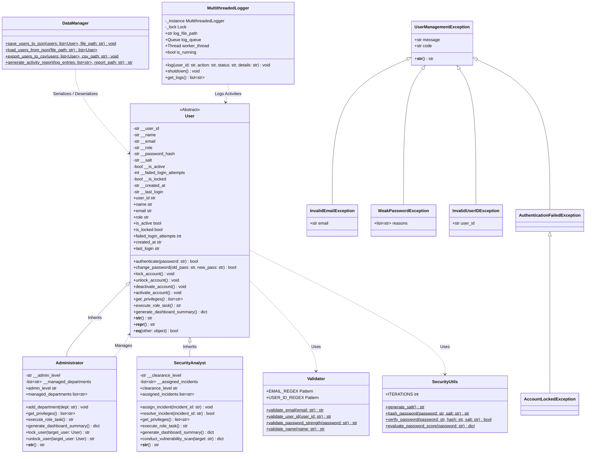

# UML Class Diagram Documentation

## System Architectural Class Diagram

The following Mermaid diagram illustrates the class hierarchy, inheritance relationships, encapsulation access modifiers (`-` private, `+` public, `#` protected), association, and utility dependencies in the Secure User Management System.

## Class Relationship Descriptions

1. **Inheritance (`User` -> `Administrator`, `SecurityAnalyst`)**:
   - `Administrator` and `SecurityAnalyst` extend the base `User` class via `super().__init__()`.
   - Polymorphic method overriding is applied on `get_privileges()`, `execute_role_task()`, and `generate_dashboard_summary()`.

2. **Encapsulation**:
   - Attributes prefixed with `__` are strictly private to prevent direct access to sensitive credentials (`__password_hash`, `__salt`) or internal flags (`__failed_login_attempts`, `__is_locked`).
   - Access is mediated through public `@property` getters and validated setters.

3. **Exception Handling**:
   - `UserManagementException` forms the root of a specialized custom exception hierarchy.

4. **Utilities & Multithreading**:
   - `Validator` enforces regular expression rules.
   - `SecurityUtils` performs salted PBKDF2 HMAC SHA-256 hashing.
   - `MultithreadedLogger` runs a background consumer thread processing an asynchronous `queue.Queue`.
   - `DataManager` handles JSON state persistence and CSV report generation.
